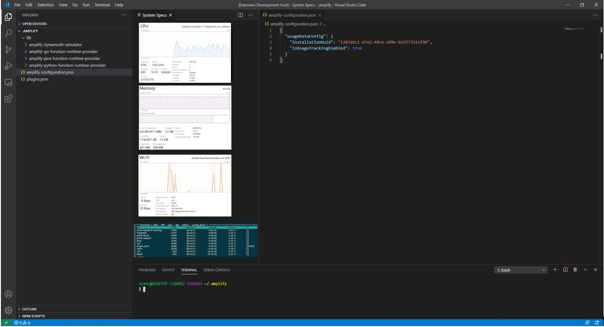

# SSED README

We created System Status Executive Display (SSED) so that you could see programs and process running on your computer directly from VS Code. This will allow you to optimize performance based on computer specs that are running at any moment.

## Problem

Visual Studio Code (VS Code) is a popular IDE and program for coding. Developers may run into issues with processing speeds and not be aware of programs running unnecessarily.

## Opportunity

End-users can use our product to run necessary programs and shut down processes that interfere with speeds and processing.

It is free and open-source.

## Features

Efficiency in programming ensures optimum performance.

* CPU
* Memory
* WiFi
* Running Processes Table

---

---

## Requirements

You only need VS Code and a Github account to clone or fork from our repository.

1. Fork from Github
2. Open VS Code
3. Click on “System Specs Display” icon

Impact: System specs are displayed to the user

## Created by

Alan: UMass Computer Engineering Senior

Curtiss: UMass Anthropology Alumni ‘10, ASU Graduate Student Learning Sciences

John: LaSalle Computer Science Sophomore

Mano: UMass Computer Science Freshman

## Extension Settings

Include if your extension adds any VS Code settings through the `contributes.configuration` extension point.

For example:

This extension contributes the following settings:

* `myExtension.enable`: enable/disable this extension
* `myExtension.thing`: set to `blah` to do something

## Known Issues

None at this time.

## Release Notes

This is the launch of SSED for MLH UMass Hacks!

### 1.0.0

Initial release of SSED

**Enjoy!**